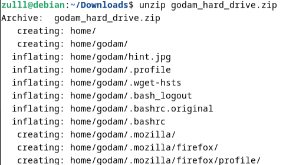
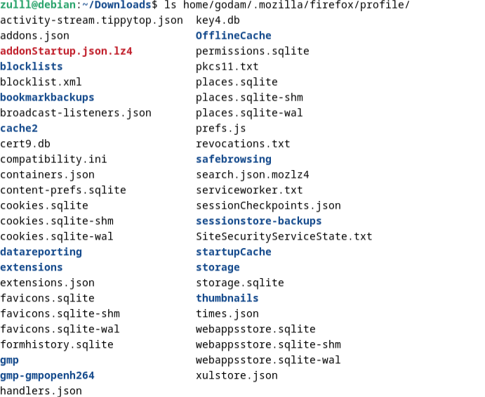
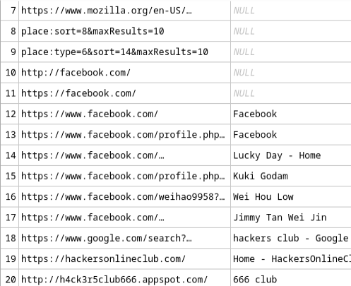
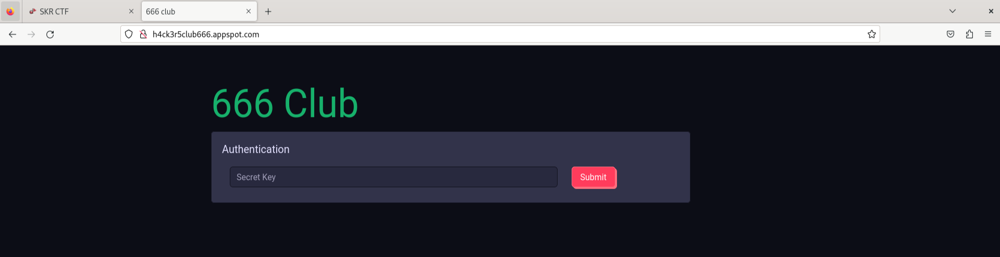
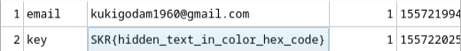
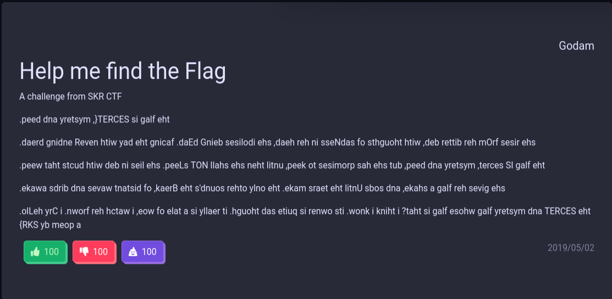
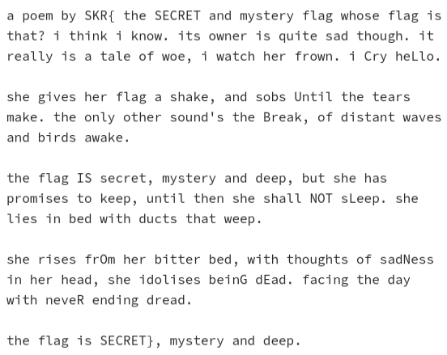

# SKR CTF: Godam Secrets
*Cylroth created this page on Dec 1, 2024*

## Description
We managed to recover part of Godam's hard drive in his house, but we couldn't find anything suspicious. We hope you can help us in finding his secret.

## Hints
1. Where does Firefox history stores at?
2. Visit [here](https://sqliteonline.com/) to open sqlite file

## Files
**godam_hard_drive.zip**

## Solution
### Recon
- Seem to be having a sqlite file in the zip file.
### Execution
To begin with, I unzip the file using `unzip godam_hard_drive.zip` .After that, "home" file will be created in the directory. According to the first hint, I found that Firefox history store at "profile" directory. I'm redirecting my directory using `cd home/godam/.mozilla/firefox/profile/` (The address is copied from unzip command process)

Next,using `ls` I can see some .sqlite file which is my focus as it store information about user history of using Firefox but as I am not familiar with Firefox file structure I read [this](https://medium.com/@jsaxena017/web-browser-forensics-part-2-firefox-browser-3dc6ef104607) article to understand it. 

places.sqlite file is storing user history. So using [this](https://sqlitebrowser.org/) tool I opened the file and found that the user has visited these urls:

After some deduction, the "666 Club" url is the most suspicious. After visiting the url it seem that I need to enter a private key.

To check user Form History I open formhistory.sqlite.

It seem that the user key in something so I copied it and the website redirect me to some kind of page with gilberishes. In the page it seem to have a flag attached but it writen in a weird way. 

So I tried reverse the text and got this:

It seem to be too long to be a flag so I remove some characters and viola.

### Flag

SKR{SECRETCLUBISNOTL0NGERSECRET}

